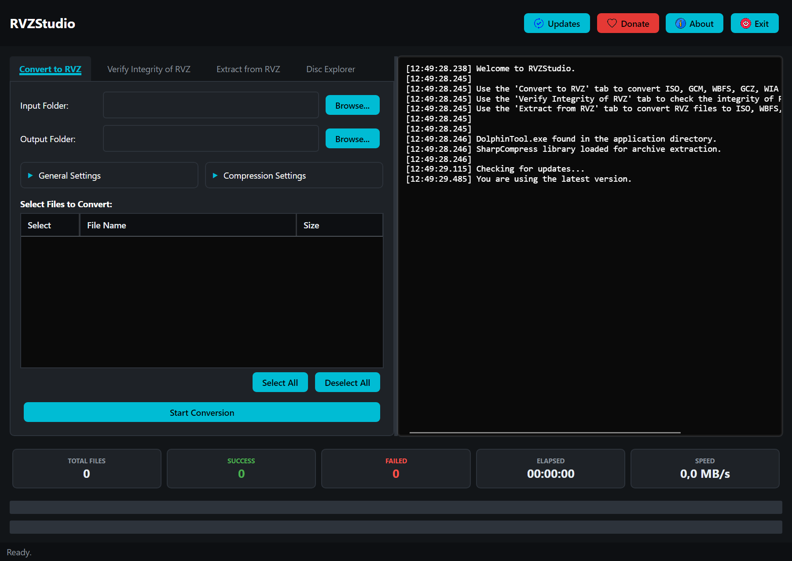
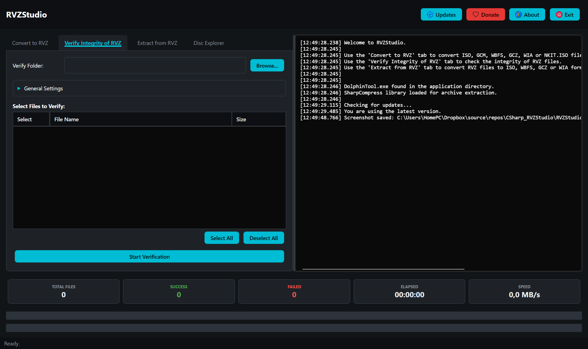
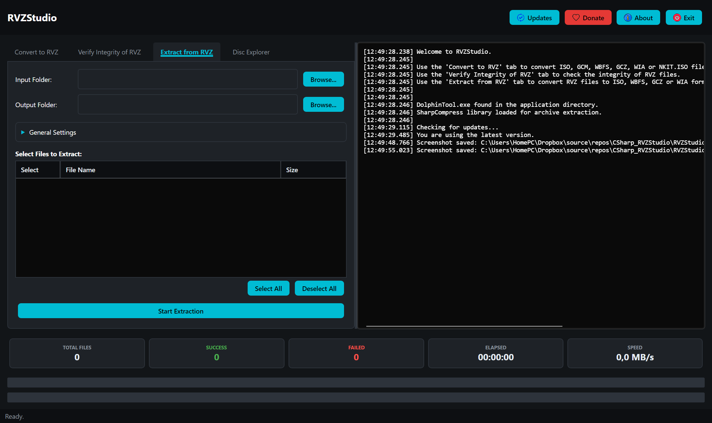

[](https://github.com/purelogiccode/BatchConvertToRVZ/releases)
[](https://dotnet.microsoft.com/download/dotnet/10.0)
[](https://avaloniaui.net/)
[](https://github.com/purelogiccode/BatchConvertToRVZ/actions/workflows/ci.yml)
[](LICENSE.txt)
[](https://github.com/purelogiccode/BatchConvertToRVZ/releases)

# RVZStudio

A cross-platform desktop utility for batch converting GameCube and Wii disc images to RVZ format with verification capabilities.





## Documentation

Full documentation lives in the [`doc/`](doc/README.md) folder:

| Page | Description |
|------|-------------|
| [Getting Started](doc/getting-started.md) | Requirements, installation and quick start. |
| [User Guide](doc/user-guide.md) | Walkthrough of every screen and control. |
| [Settings Reference](doc/settings-reference.md) | Compression methods, levels, block sizes and options. |
| [Troubleshooting](doc/troubleshooting.md) | Solutions for common problems. |
| [FAQ](doc/faq.md) | Frequently asked questions. |
| [Architecture](doc/architecture.md) | Internal design and data flow. |
| [Building](doc/building.md) | Build, test, publish and CI/CD. |
| [Contributing](doc/contributing.md) | Issue reporting and pull request workflow. |

## Overview

RVZStudio is a comprehensive desktop application built with **Avalonia UI** that provides a user-friendly interface for converting multiple GameCube and Wii game files to the RVZ format. The built-in **RVZSharp** library is the primary engine for conversion, extraction and verification, with **DolphinTool** from the Dolphin Emulator project as a fallback, while providing advanced features like batch processing and archive extraction.

The application ships for **Windows, Linux and macOS** on both **x64 and ARM64** architectures.

## Features

### Conversion Features
- **Batch Processing**: Convert multiple files in a single operation.
- **Supported Input Formats**: Handles GameCube and Wii disc images (`.iso`, `.gcm`, `.wbfs`, `.gcz`, `.wia`, `.ciso`, `.wbi`, `.tgc`, `.nfs`, `.nkit.iso`) and archives containing them (`.zip`, `.7z`, `.rar`).
- **Archive Extraction**: Automatically extracts and processes game files from ZIP, 7Z, and RAR archives using SharpCompress.
- **Configurable Compression**: Customize compression method, level, and block size for optimal results.

- **Smart File Handling**: Skips files that already exist in the output directory.
- **Delete Original Option**: Optionally remove source files (including archives) after successful conversion.
- **Robust Parsing**: Advanced logic for handling compound extensions like `.nkit.iso` and localized number formats.

### Verification Features
- **RVZ Integrity Verification**: Verify the integrity of existing RVZ files natively with the RVZSharp volume verifier (partition headers, TMD/H3 tables and the h0/h1/h2/h3 hash trees), with DolphinTool as a fallback. CRC-32, MD5 and SHA-1 hashes of the decoded image are logged for every verified file.
- **Real-time Feedback**: Live logging of verification progress and results (not just at the end).

### Explorer Features
- **Disc Explorer**: Browse the file system of any supported disc image (ISO, RVZ, WIA, GCZ, CISO, WBFS, TGC, NFS) in-process without extracting it.
- **Tree Navigation**: Expand folders and select entries to see their path, type, size and data offset.
- **Copy Out**: Extract the selected file or a whole folder from the image.
- **Per-File Hashing**: Compute the SHA-256 of any file inside the image.
- **Wii Partitions**: Discs with multiple partitions (game/update/channel) expose a partition selector.
- **Batch Verification**: Check multiple RVZ files in a single operation.

- **File Organization**: Automatically move verified files to `_Success` or `_Failed` subfolders.
- **Detailed Reporting**: Get comprehensive verification results for each file.

### User Experience
- **Smooth Progress Tracking**: A single, overall progress bar that smoothly tracks the entire batch operation, including real-time percentages from active tasks.
- **Intelligent Auto-Scroll**: The log viewer only snaps to the bottom if you are already looking at the latest logs, allowing you to read previous errors without interruption.
- **Immediate Cancellation**: Stop extractions and conversions instantly, even for massive 8GB+ files, thanks to asynchronous I/O and cancellation token support.
- **Optimized Logging**: Structured logging with Serilog, handling thousands of lines without UI stuttering or high memory usage.
- **Collapsible Settings Panels**: Settings sections use Expander controls (collapsed by default) to reduce visual clutter in all tabs.
- **Screenshot Capture**: Press F8 to capture the application window as a PNG screenshot.
- **Thread-Safe Dialogs**: Robust UI handling that prevents crashes when showing error messages or update prompts from background threads.
- **Auto-Update Checking**: Accurate version comparison between GitHub release tags and assembly versions with seamless GitHub integration.

### Technical Features
- **Native RVZ Engine**: Built-in `RVZSharp` library encodes, decodes and verifies disc images natively (100% managed codecs), with automatic fallback to `DolphinTool` whenever the library fails or DolphinTool is required.
- **Library Failure Reporting**: Unexpected `RVZSharp` failures are automatically reported to the Bug Report API so the library can be improved over time; expected user-file failures are logged without bug-report noise.
- **Asynchronous Architecture**: Fully async/await implementation to keep the UI responsive during intensive I/O and processing.
- **Cross-Architecture Support**: Native support for both x64 and ARM64 Windows systems.
- **Structured Logging**: Serilog-based logging with rolling daily log files, on-screen log viewer, and automatic bug reporting via custom sinks.
- **Global Error Reporting**: Automatic bug reporting to developers with comprehensive error details.
- **Process Error Suppression**: Prevents Windows error dialogs from child processes (DolphinTool) from blocking batch operations.
- **Robust Child-Process Handling**: DolphinTool/7za startup failures (missing or blocked executables) are handled gracefully — the batch continues with the real error logged instead of crashing on process cleanup.
- **Cross-Platform UI**: The Avalonia-based interface runs natively on Windows, Linux and macOS, and automatically locates the platform-specific helper executables.
- **Robust Cleanup**: Asynchronous retry logic for deleting locked temporary files and directories.
- **Memory Management**: Efficient string handling and proper resource disposal to prevent leaks.

## Architecture

The application follows a modular architecture with clear separation of concerns:

| Component | Responsibility |
|-----------|----------------|
| `MainWindow` | UI coordination, user interaction handling, operation orchestration |
| `ConversionService` | Core conversion logic, progress tracking, cancellation support |
| `VerificationService` | RVZ integrity verification with real-time output |
| `ExtractionService` | Archive extraction (ZIP, 7Z, RAR) with cancellation support |
| `DiscExplorerService` | Disc file-system browsing, copy-out and hashing via the RVZSharp FST parser |
| `FileService` | File scanning, filtering, and output path management |
| `RvzSharpService` | Native RVZ encode/decode via the RVZSharp library, with DolphinTool fallback |
| `UpdateService` | GitHub API integration for checking application updates |
| `BugReportService` | Automatic error reporting to development team |
| `StatsService` | Statistics tracking for conversion and verification operations |
| `ScreenshotService` | Window screenshot capture (F8) |
| `UiLogSink` / `BugReportSink` | Serilog sinks for UI log display and automatic bug reporting |
| `ProcessHelper` | Suppresses Windows error dialogs from child processes |
| `SharedHttpHandler` | Shared HttpClient configuration for update and bug report services |
| `FileItem` | Data model for file state, progress, and status tracking |
| `GitHubRelease` | Data model for GitHub release information |
| `SystemInfo` | System information data model |
| `DolphinTool` | External fallback tool for RVZ conversion and verification |
| `RVZSharp` | Third-party library for native RVZ encode/decode |
| `SharpCompress` | Third-party library for archive extraction |

## Conversion Engine

RVZStudio uses **RVZSharp** — a pure managed C# library — as its primary engine for
converting disc images to RVZ (encode), decoding RVZ/WIA to any output format, and verifying
RVZ integrity:

- **Encode**: `RVZSharp` encodes ISO/GCM/WBFS/GCZ/WIA/CISO/TGC/NFS images natively with the
  selected compression method (zstd, bzip2, lzma, lzma2), level and block size. The `zlib` and
  `lz4` methods are DolphinTool-only and always use the external tool. A **Scrub** option zeroes
  non-game Wii partitions before encoding.
- **Decode**: `RVZSharp` writes ISO (parallel full-image decode), WIA, GCZ, WBFS, CISO and TGC
  natively. DolphinTool is only used as a fallback for the formats it supports (ISO/WIA/GCZ/WBFS).
- **Verify**: `RVZSharp` runs Dolphin's volume verification (Wii partition hash trees plus the
  TMD/H3 tables) and logs the decoded image's CRC-32, MD5 and SHA-1. DolphinTool `verify` is used
  as a fallback.
- **Automatic Fallback**: If the library fails on a file (corrupt input, unsupported feature,
  etc.), the application automatically falls back to `DolphinTool` for that file when DolphinTool
  supports the operation, and the batch continues normally.
- **Input Pre-validation**: Before encoding, the application verifies the input actually looks
  like a disc image — the GameCube/Wii disc header magic (Wii `5D 1C 9E A3` at offset 0x18,
  GameCube `C2 33 9F 3D` at offset 0x1C) on ISO/GCM files, and the real container magic
  (`WBFS`, GCZ `01 C0 0B B1`, `WIA\x01`/`RVZ\x01`, CISO `CISO`, TGC `AE 0F 38 A2`, NFS `EGGS`)
  on container files. Unrecognized data is sent to `DolphinTool` instead of being wrapped into a
  broken RVZ.
- **Failure Reporting**: Unexpected RVZSharp failures are logged at Error level and automatically
  sent to the Bug Report API with full error details; expected user-input failures (corrupt files,
  format mismatches, missing NFS keys) are logged at Information level.

## Supported File Formats

### Input Formats
- **ISO files**: GameCube and Wii disc images (`.iso`)
- **GCM files**: GameCube disc images (`.gcm`)
- **WBFS files**: Wii Backup File System images (`.wbfs`, including split `.wbf1…` parts)
- **GCZ files**: Dolphin compressed disc images (`.gcz`)
- **WIA files**: Older Dolphin containers (`.wia`)
- **CISO/WBI files**: Block-compressed images (`.ciso`, `.wbi`)
- **TGC files**: Tiny GameCube images (`.tgc`)
- **NFS files**: Wii U–era EGGS images (`.nfs`, with the `code/htk.bin` key file alongside)
- **NKit ISO files**: NKit compressed ISO files (`.nkit.iso`)
- **Archive files**: ZIP, 7Z, and RAR archives containing game files (`.zip`, `.7z`, `.rar`)

### Output Formats
- **RVZ files**: Compressed GameCube/Wii disc images (`.rvz`)
- **Extraction outputs**: ISO, WIA, GCZ, WBFS, CISO and TGC

## Requirements

- **Runtime**: [.NET 10.0 Runtime](https://dotnet.microsoft.com/download/dotnet/10.0) (not required for the self-contained release builds)
- **Operating System**: Windows 10 or later, a modern Linux distribution, or macOS (x64 or ARM64)
- **Dependencies**: The built-in RVZSharp engine requires no external tools. Release packages also bundle optional fallbacks:
  - Windows: `DolphinTool.exe` / `DolphinTool_arm64.exe` and `7za.exe` / `7za_arm64.exe`
  - Linux/macOS: `DolphinTool` / `DolphinTool_arm64` and `7za` / `7za_arm64`

## Installation

1. Download the latest release for your platform from the [Releases page](https://github.com/purelogiccode/BatchConvertToRVZ/releases)
2. Extract the archive to a folder of your choice
3. Run `RVZStudio.exe` (Windows) or `./RVZStudio` (Linux/macOS)

> **Linux/macOS note:** The bundled helper executables must be executable. The application sets the
> execute permission automatically when needed, but if the application was extracted by a tool that
> strips permissions you can run `chmod +x DolphinTool* 7za* RVZStudio` once.

## Usage

### Converting Files

1. **Select Input Folder**: Click "Browse" next to "Input Folder" to select the folder containing game files or archives to convert.
2. **Select Output Folder**: Click "Browse" next to "Output Folder" to choose where the RVZ files will be saved.
3. **Configure General Settings**:
   - Check "Delete original files after conversion" to remove source files after successful conversion.
   - Check "Scrub non-game Wii partitions (update/channel)" to zero non-game partition data before encoding for smaller RVZ files.

4. **Configure Compression Settings**:
   - **Method**: Choose compression algorithm (zstd, zlib, lzma, lzma2, bzip2, lz4).
   - **Level**: Adjust compression level (varies by method, e.g., 1-22 for zstd).
   - **Block Size**: Select block size (32KB to 2MB, 128KB recommended).
5. **Start Conversion**: Click "Start Conversion" to begin the batch process.
6. **Monitor Progress**: Watch the smooth overall progress bar, statistics, and real-time log messages.
7. **Cancel (if needed)**: Click "Cancel" to stop the operation gracefully and instantly.

### Verifying RVZ Files

1. **Switch to Verify Tab**: Click the "Verify Integrity" tab.
2. **Select Verify Folder**: Click "Browse" to select the folder containing RVZ files to verify.
3. **Configure Options**:

   - Check "Move failed RVZ files to '_Failed' subfolder" to organize problematic files.
   - Check "Move successful RVZ files to '_Success' subfolder" to organize verified files.
4. **Start Verification**: Click "Start Verification" to begin checking file integrity with real-time feedback.
5. **Review Results**: Check the log and statistics for detailed verification results.

### Exploring Disc Contents

1. **Switch to Explorer Tab**: Click the "Explorer" tab.
2. **Select Image File**: Click "Browse..." to choose any supported disc image (ISO, RVZ, WIA, GCZ, CISO, WBFS, TGC or NFS).
3. **Open**: Click "Open" to parse the image's file system and show its volume information.
4. **Browse**: Expand folders in the tree and select an entry to see its path, type, size and data offset.
5. **Copy Out**: Click "Copy Out..." to extract the selected file (or a whole folder) to disk.
6. **Hash**: Click "SHA-256" to compute the hash of the selected file without extracting it.
7. **Wii Discs**: Use the partition selector to switch between game, update and channel partitions.

### Header Actions

- **Updates**: Manually check for new versions on GitHub.
- **About**: View application information and credits.
- **Exit**: Close the application.

### Screenshot Capture

Press **F8** at any time to capture the application window. Screenshots are saved as timestamped PNG files in the `Screenshot` folder inside the application directory.

## Compression Settings Guide

### Compression Methods
| Method | Speed | Compression | Use Case |
|--------|-------|-------------|----------|
| **zstd** (default) | Fast | Good | Best balance for most users |
| zlib | Medium | Good | Maximum compatibility |
| lzma/lzma2 | Slow | Excellent | Maximum compression |
| bzip2 | Slow | Good | Alternative option |
| lz4 | Very Fast | Moderate | Speed priority |

### Recommended Settings
- **Default**: zstd, level 5, 128KB block size
- **Maximum Compression**: lzma2, level 9, 2MB block size
- **Fastest Conversion**: lz4, level 1, 32KB block size

## About RVZ Format

RVZ is a compressed disk image format developed specifically for the Dolphin Emulator. It is designed to store GameCube and Wii game data efficiently while retaining all necessary information for emulation.

### Key Benefits
- **Efficient Compression**: Significantly reduces file sizes compared to raw ISO images using advanced compression algorithms like Zstandard.
- **Lossless**: Compression is completely lossless, meaning no game data is lost during conversion.
- **Metadata Preservation**: Maintains all important disc metadata and structure.
- **Data Integrity**: Includes built-in verification to ensure image integrity.
- **Full Compatibility**: Directly supported by modern versions of Dolphin Emulator.
- **Faster Loading**: Often loads faster than uncompressed ISOs due to reduced I/O overhead.

## Troubleshooting

- **Missing Dependencies**: `DolphinTool` is optional — the built-in RVZSharp engine handles conversion, extraction and verification on its own. If the DolphinTool fallback is needed but missing, add `DolphinTool.exe` (or `DolphinTool_arm64.exe` for ARM64 systems) to the application directory.
- **Permission Issues**: Make sure you have read permissions for input directories and write permissions for output directories.
- **Archive Extraction Failures**: Verify that the archive files are not corrupted. The app now supports instant cancellation if extraction hangs.
- **Conversion Errors**: Check the detailed real-time log output for specific error messages. Log files are also saved to `%LocalAppData%\RVZStudio\logs\`.
- **Font-Related Rendering Issues**: If UI text fails to render on systems with missing or broken system fonts, the application stays running and logs the font error — consider restoring your system fonts.
- **Performance Issues**: Try reducing the number of concurrent files if you experience system instability.
- **Auto-Reporting**: The application automatically reports unexpected errors to developers for continuous improvement.

## Development

### Project Structure
```
RVZStudio/
├── Program.cs               # Entry point / Avalonia AppBuilder bootstrap
├── App.axaml                # Application resources, dark theme and control styles
├── App.axaml.cs             # Application entry point, global exception handling, Serilog bootstrap
├── MainWindow.axaml         # Main UI definition
├── MainWindow.axaml.cs      # Main UI logic and operation orchestration
├── AboutWindow.axaml        # About dialog UI
├── AboutWindow.axaml.cs     # About dialog logic
├── dialogs/
│   └── MessageBox.axaml     # Cross-platform, theme-styled message box
├── services/
│   ├── BugReportService.cs  # Automatic error reporting service
│   ├── BugReportSink.cs     # Serilog sink: forwards Warning+ events to BugReport API
│   ├── ConversionService.cs # Core conversion logic
│   ├── ExtractionService.cs # Archive extraction logic
│   ├── FileService.cs       # File scanning and filtering
│   ├── LoggingSinkExtensions.cs # Serilog configuration extensions
│   ├── ProcessHelper.cs     # Child process helpers (error dialogs, execute bits)
│   ├── ScreenshotService.cs # F8 window screenshot capture
│   ├── SharedHttpHandler.cs # Shared HTTP client configuration
│   ├── StatsService.cs      # Statistics tracking service
│   ├── UiLogSink.cs         # Serilog sink: forwards log events to the UI
│   ├── UpdateService.cs     # GitHub update checking service
│   └── VerificationService.cs # RVZ integrity verification
├── models/
│   ├── FileItem.cs          # File state and progress tracking model
│   ├── GitHubRelease.cs     # GitHub API response model
│   └── SystemInfo.cs        # System information model
├── icon/                    # Application icons
├── images/                  # UI images (menu icons, logo)
└── DolphinTool*.exe         # External conversion/verification tool (Windows)
RVZStudio.Tests/             # Unit tests (xUnit)
doc/                         # Documentation (see doc/README.md)
.github/workflows/           # CI and release pipelines
publish.ps1                  # Multi-platform publish script
```

### Building from Source
1. Install [.NET 10.0 SDK](https://dotnet.microsoft.com/download/dotnet/10.0)
2. Clone the repository
3. Run `dotnet build` or open in Visual Studio / JetBrains Rider / Visual Studio Code

See the [Building guide](doc/building.md) for full instructions.

### Publishing
The `publish.ps1` script produces self-contained, single-file builds for every supported platform
(`win-x64`, `win-arm64`, `linux-x64`, `linux-arm64`, `osx-x64`, `osx-arm64`) into the `publish/`
folder. The DolphinTool/7za helper executables are placed next to the application binary so they
can be launched as child processes.

```powershell
./publish.ps1
```

A single target can also be published manually:
```bash
dotnet publish RVZStudio/RVZStudio.csproj -c Release -r linux-x64 \
    --self-contained true -p:PublishSingleFile=true -p:IncludeNativeLibrariesForSelfExtract=true
```

### Continuous Integration
GitHub Actions pipelines live in `.github/workflows/`:

- **CI** (`ci.yml`) builds and tests on Windows, Linux and macOS for every push and pull request,
  and smoke-tests Linux publishing.
- **Release** (`release.yml`) publishes all six runtime identifiers and attaches the ZIP archives
  to a GitHub Release when a `v*` tag is pushed.

See the [Building guide](doc/building.md#continuous-integration) for details.

### Running Tests
The project includes unit tests covering models and services using xUnit:
```bash
dotnet test
```

## Acknowledgements

- **DolphinTool**: Uses `DolphinTool` from the [Dolphin Emulator project](https://dolphin-emu.org/) as a fallback for RVZ conversion, extraction and verification.
- **RVZSharp**: Uses the [RVZSharp](https://github.com/purelogiccode/RVZSharp) library as the primary engine for native disc image encoding, decoding and verification.
- **SharpCompress**: Uses the [SharpCompress](https://github.com/adamhathcock/sharpcompress) library for reliable archive extraction.
- **Serilog**: Uses [Serilog](https://serilog.net/) for structured logging with custom sinks.
- **Development**: Created and maintained by [Pure Logic Code](https://www.purelogiccode.com)

## Support the Project

### ⭐ Give us a Star!
If you find this application useful, please consider giving us a star on GitHub! It helps others discover the project and motivates us to continue improving it.

[⭐ Star this project on GitHub](https://github.com/purelogiccode/BatchConvertToRVZ)

### 💖 Support Development
This application is developed and maintained for free. If you'd like to support continued development and new features, consider making a donation:

[💖 Donate to Pure Logic Code](https://www.purelogiccode.com/donate)

Your support helps us:
- Add new features and improvements
- Maintain compatibility with new versions of dependencies
- Provide ongoing bug fixes and support
- Create more useful tools for the community

---

Thank you for using **RVZStudio**! For more information, support, and other useful tools, visit [purelogiccode.com](https://www.purelogiccode.com)
