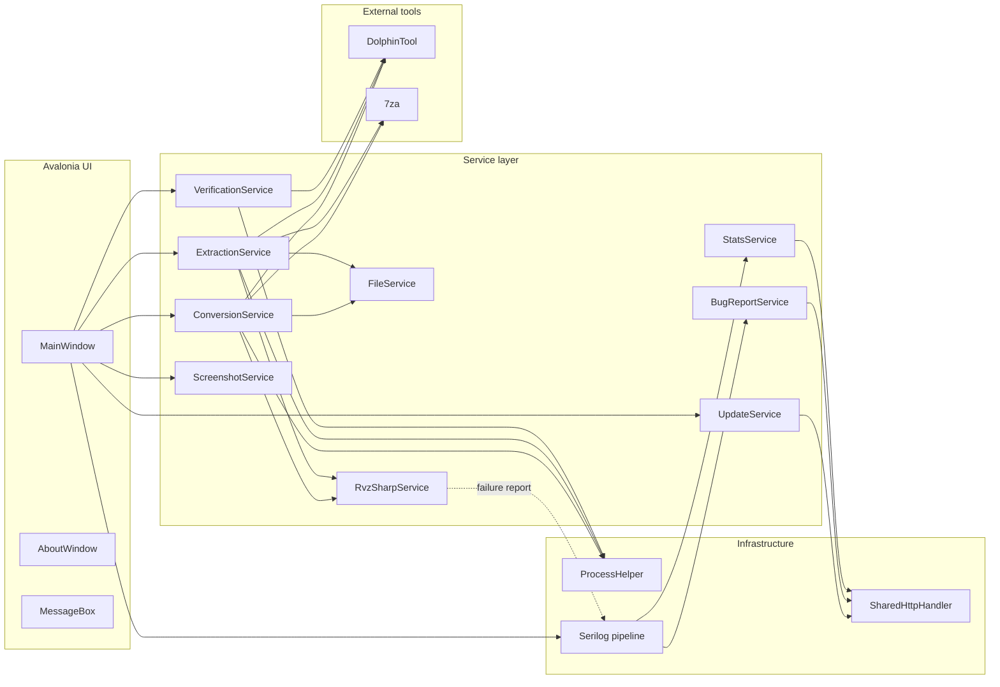
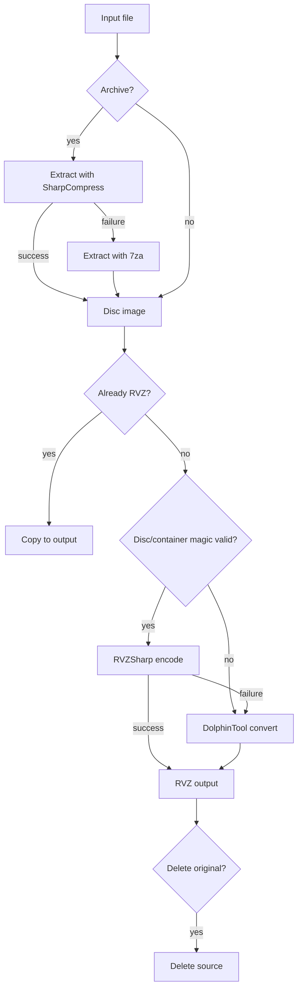

# Architecture

RVZStudio is a single-process Avalonia desktop application with a small service layer. This page
describes how the pieces fit together and how data flows through the application.

## High-level overview



## UI layer

| Component | Responsibility |
|-----------|----------------|
| `Program` | Entry point; configures the Avalonia `AppBuilder` and starts the classic desktop lifetime. |
| `App` | Application-wide resources and styles, Serilog bootstrap, global exception handling, service singletons. |
| `MainWindow` | The whole main UI: tab orchestration, file lists, progress, statistics, log viewer and drag and drop. |
| `AboutWindow` | Version, description and acknowledgements. |
| `dialogs/MessageBox` | A theme-styled, cross-platform replacement for the WPF message box. |

The UI follows a code-behind style: `MainWindow.xaml.cs` coordinates the services and marshals all
service callbacks onto the Avalonia dispatcher. There is no MVVM framework.

## Service layer

| Service | Responsibility |
|---------|----------------|
| `ConversionService` | Batch conversion loop, archive handling, output naming, deletion, cancellation. |
| `VerificationService` | RVZSharp volume verification with DolphinTool `verify` as fallback, result handling and file moves. |
| `ExtractionService` | RVZ/WIA decoding to ISO/WIA/GCZ/WBFS/CISO/TGC with the same fallback model as conversion. |
| `DiscExplorerService` | Opens any supported image with RVZSharp, parses the FST, copies entries out and hashes files. |
| `FileService` | Extension sets, filtering and base-name handling for compound extensions such as `.nkit.iso`. |
| `RvzSharpService` | Native encode/decode/verify via the RVZSharp library, disc metadata, hashes and input pre-validation. |
| `ScreenshotService` | `F8` window capture using Avalonia `RenderTargetBitmap`. |
| `UpdateService` | GitHub Releases API client with semantic version comparison. |
| `BugReportService` | Sends error reports with environment and stack-trace details. |
| `StatsService` | Sends anonymous launch statistics. |
| `ProcessHelper` | Child-process helpers: Windows error-dialog suppression and Unix execute bits. |
| `SharedHttpHandler` | One shared `HttpClientHandler`/connection pool for all HTTP services. |
| `UiLogSink` / `BugReportSink` | Serilog sinks that forward log events to the UI and the bug-report API. |

## Conversion pipeline



Key behaviors:

1. **Archive handling** — SharpCompress is tried first; `7za` is the fallback. The first RVZ or
   supported disc image found in the archive is processed.
2. **Pre-validation** — ISO/GCM inputs are checked for the GameCube (`C2 33 9F 3D` at `0x1C`) or
   Wii (`5D 1C 9E A3` at `0x18`) disc magic; container formats are checked for their real magic.
   Unrecognized data goes straight to DolphinTool.
3. **Native-first conversion** — RVZSharp writes `zstd`, `bzip2`, `lzma` and `lzma2`; `zlib` and
   `lz4` are DolphinTool-only. An optional Scrub setting zeroes non-game Wii partitions before
   encoding.
4. **Fallback and reporting** — expected user-input failures (corrupt files, format mismatches)
   are logged at Information level and the file is retried with DolphinTool; unexpected library
   failures are logged at Error level, which automatically forwards them to the bug-report API.

## Verification and extraction pipelines

- **Verification** runs the native RVZSharp volume verifier first (Wii partition headers, TMD/H3
  tables and the h0/h1/h2/h3 hash trees) and logs the decoded image's CRC-32/MD5/SHA-1 hashes.
  If the library cannot verify the file, `DolphinTool verify -i <file>` is used as a fallback
  (exit code `0` plus `Problems Found: No`). Files can optionally move to `_Success` / `_Failed`.
- **Extraction** writes ISO (parallel full-image decode), WIA, GCZ, WBFS, CISO and TGC with
  RVZSharp. DolphinTool is the fallback for the four formats it supports (ISO/WIA/GCZ/WBFS);
  CISO and TGC are RVZSharp-only. Existing outputs are deleted before conversion and the source
  can optionally be removed afterwards.
- **Explorer** opens the image with `Blob.Open`, parses the selected Wii partition's (or the
  GameCube disc's) FST with `DiscFileSystem`, and exposes the tree. Expanding a folder
  materializes children from the in-memory FST (no I/O); copy-out streams decrypted file bytes
  with `CopyFileTo`; hashing feeds those bytes into an `IncrementalHash` sink. Entry names are
  sanitized so hostile FST names cannot escape the destination folder.

## Threading and responsiveness

- Batch operations run on the thread pool (`Task.Run`) with a `CancellationTokenSource` per run.
- Service progress callbacks are marshalled to the UI with `Dispatcher.UIThread.Post` /
  `InvokeAsync`.
- Log events are buffered through an unbounded `Channel<string>` and applied to the UI in batches
  of up to 50 lines, which keeps the interface responsive under heavy output.
- Child processes are killed on cancellation; the application waits briefly for cleanup before
  allowing the window to close.

## Logging

Serilog is configured at startup with three sinks:

| Sink | Destination |
|------|-------------|
| `UiLogSink` | The on-screen log viewer (via an event that `MainWindow` consumes). |
| `BugReportSink` | The bug-report API for `Warning` and above. |
| File sink | Rolling daily files in the platform's local application data folder (10 MB per file, 14 files retained). |

The log viewer keeps at most 5,000 lines; it auto-scrolls only when the user is already at the
bottom.

## Platform integration

- **Tool discovery** — helper names are derived from `OperatingSystem` and
  `RuntimeInformation.ProcessArchitecture` (`DolphinTool(.exe)` / `DolphinTool_arm64(.exe)`, and
  the same for `7za`).
- **Unix permissions** — before launching a helper, RVZStudio ensures the execute bits are set,
  because ZIP archives do not preserve them.
- **Windows error dialogs** — `SetProcessErrorMode` suppresses blocking dialogs from child
  processes on Windows; the call is a no-op elsewhere.
- **Dialogs** — folder pickers use Avalonia's storage provider, and the custom message box renders
  consistently on all platforms.

## Project layout

```
RVZStudio/
├── Program.cs               # AppBuilder bootstrap
├── App.axaml(.cs)           # Resources, styles, logging, global error handling
├── MainWindow.axaml(.cs)    # Main UI and orchestration
├── AboutWindow.axaml(.cs)   # About dialog
├── dialogs/                 # Cross-platform message box
├── services/                # Conversion, verification, extraction, logging, HTTP services
├── models/                  # FileItem, GitHubRelease, SystemInfo
├── icon/                    # Application icons
├── images/                  # UI images
└── tools/                   # Bundled 7za binaries per runtime identifier
```

## Related pages

- [Building](building.md) — compile, test and package the application.
- [Settings Reference](settings-reference.md) — user-facing configuration.
